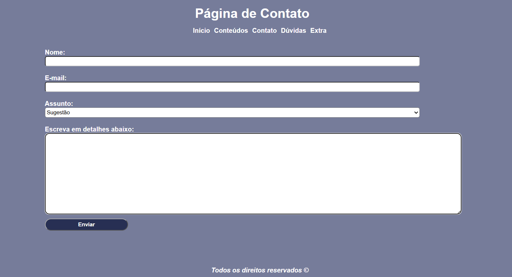
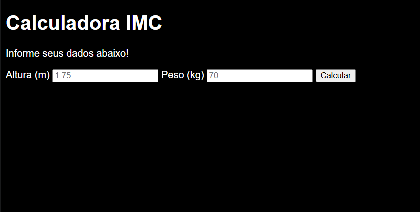
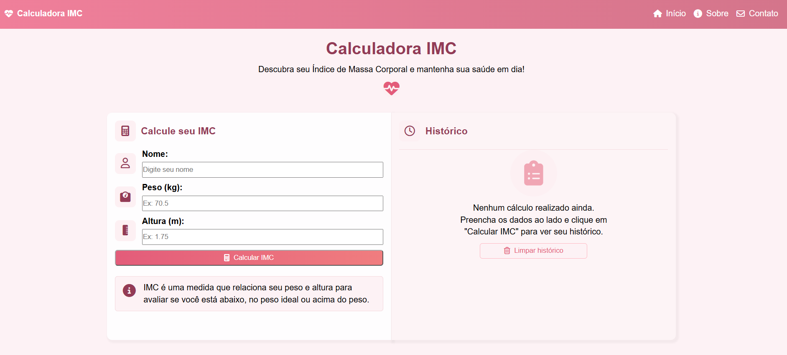
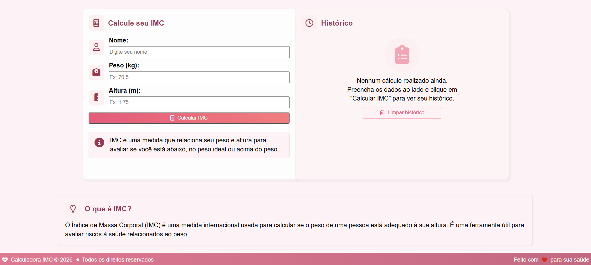
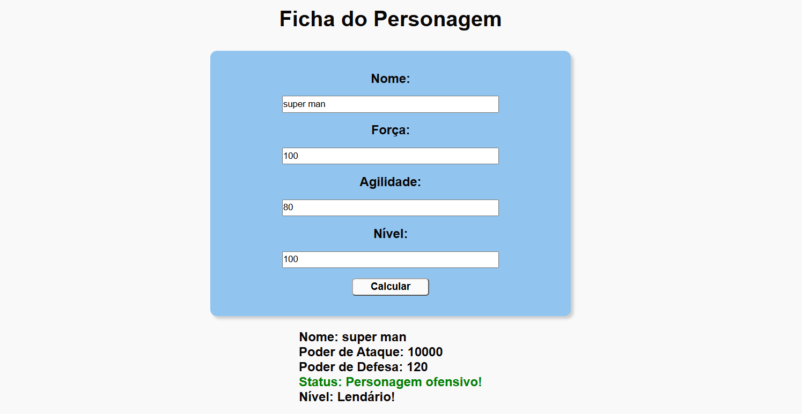

# exercicios-frontend
Exercícios práticos de HTML, CSS e JavaScript durante minha formação em Front-End.

## Projetos

🔗 **[Ver projetos ao vivo](https://camilalaughton.github.io/exercicios-frontend/)**

### HTML/CSS

**Cartão de perfil** — Card de apresentação de uma profissional de tecnologia. Tags semânticas, favicon, links externos, Flexbox, abordagem mobile-first com media queries.
 
 
 

**Página de contato** — Formulário de contato com labels associados, variáveis CSS (`:root`), animação de entrada (fadeIn), Flexbox, mobile-first com media queries.
 
 
 

**Landing page** — Página de vendas de hortifruti. Ícones, listas, imagens, Flexbox, classes e IDs, box model, animações com keyframes, pseudo-classes, media queries.

  
 

**Dashboard de blog** — Página de blog com artigos sobre tecnologia. Ícones, links externos, classes, IDs, pseudo-classes, Flexbox e CSS Grid combinados, mobile-first com media queries.

  
 

### JavaScript

**Calculadora de IMC** — Cálculo de IMC com manipulação do DOM. Formulário, funções, conversão de string para número, estrutura condicional `if`, expressões booleanas, operadores lógicos, `===`, `isNaN`, operações matemáticas.

 
 

**Calculadora de IMC com histórico** — Evolução do projeto anterior: registra um histórico das consultas feitas. Flexbox e Grid, DOM, funções, laço `for`, conversão de tipos, cálculos matemáticos, mobile-first com media queries.

  
 

**Calculadora de troco** — Cálculo de troco com lógica condicional. Formulário, funções, DOM, estrutura condicional `if`, expressões booleanas, operadores lógicos. 
 
 
 

**Ficha de personagem** — A partir dos atributos informados, calcula poder de ataque, defesa, status e nível do personagem. Formulário, classes, IDs, pseudo-classes, Flexbox, DOM, estrutura `if/else`, expressões booleanas, operadores lógicos.
 
 
 

Repositório em construção, atualizado conforme avanço nos estudos de Front-End.
